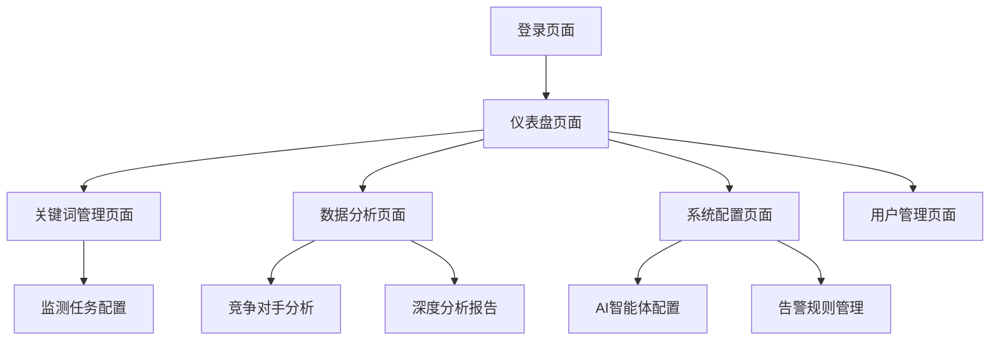

# 自动化GEO智能评估平台 - 产品需求文档

## 1. 产品概述

自动化GEO智能评估平台是一个基于AI查询智能体的数据监测和分析系统，专门用于大规模、持续地收集和分析Google AI Overviews中的品牌表现数据。

- 该平台通过模拟人类专家行为，自动化监测品牌在搜索引擎AI回答中的表现，帮助企业实时了解其在AI驱动搜索结果中的可见度和影响力。
- 目标市场价值：为数字营销团队和SEO专家提供前沿的AI搜索优化洞察，抢占AI搜索时代的营销先机。

## 2. 核心功能

### 2.1 用户角色

| 角色 | 注册方式 | 核心权限 |
|------|----------|----------|
| 系统管理员 | 内部账号分配 | 系统配置、用户管理、全局数据访问 |
| GEO分析师 | 邀请码注册 | 数据分析、报告生成、告警配置 |
| 业务用户 | 邮箱注册 | 查看仪表盘、基础数据导出 |

### 2.2 功能模块

我们的GEO智能评估平台包含以下主要页面：

1. **仪表盘页面**：核心指标展示、趋势分析图表、实时告警状态
2. **关键词管理页面**：关键词配置、监测任务设置、搜索策略管理
3. **数据分析页面**：深度分析报告、竞争对手对比、归因分析
4. **系统配置页面**：智能体配置、代理设置、告警规则管理
5. **用户管理页面**：账户管理、权限配置、使用统计

### 2.3 页面详情

| 页面名称 | 模块名称 | 功能描述 |
|----------|----------|----------|
| 仪表盘页面 | 核心指标面板 | 显示AI回答占有率(SoV)、引用类型分布、关键词表现排行 |
| 仪表盘页面 | 趋势分析图表 | 展示时间序列数据、对比分析、预测趋势 |
| 仪表盘页面 | 实时告警中心 | 显示告警状态、异常提醒、快速响应入口 |
| 关键词管理页面 | 关键词库管理 | 添加、编辑、删除关键词；批量导入；分类管理 |
| 关键词管理页面 | 监测任务配置 | 设置监测频率、地理位置、设备类型、搜索引擎选择 |
| 关键词管理页面 | 搜索策略设置 | 配置User-Agent轮换、代理IP策略、反屏蔽参数 |
| 数据分析页面 | 深度分析报告 | 生成周期性分析报告、数据洞察、优化建议 |
| 数据分析页面 | 竞争对手分析 | 对比竞争对手SoV、识别机会关键词、市场份额分析 |
| 数据分析页面 | 归因分析模块 | 分析引用来源、链接类型分布、内容贡献度评估 |
| 系统配置页面 | AI智能体配置 | 配置Playwright参数、元素定位模型、NLP处理规则 |
| 系统配置页面 | 代理与安全设置 | 管理代理IP池、配置反屏蔽策略、监控采集状态 |
| 系统配置页面 | 告警规则管理 | 设置告警阈值、通知渠道、升级规则 |
| 用户管理页面 | 账户权限管理 | 用户注册审核、角色分配、权限控制 |
| 用户管理页面 | 使用统计监控 | 查看用户活跃度、功能使用情况、系统负载 |

## 3. 核心流程

### 主要用户操作流程

**GEO分析师工作流程：**
1. 登录系统 → 查看仪表盘概览 → 分析异常指标
2. 进入关键词管理 → 配置新的监测任务 → 设置监测参数
3. 查看数据分析报告 → 对比竞争对手表现 → 生成优化建议
4. 配置告警规则 → 设置关键指标阈值 → 选择通知方式

**系统管理员工作流程：**
1. 登录系统 → 检查系统状态 → 查看采集任务运行情况
2. 配置AI智能体参数 → 更新代理IP池 → 优化采集策略
3. 管理用户权限 → 监控系统性能 → 处理异常告警

## 4. 用户界面设计

### 4.1 设计风格

- **主色调**：深蓝色 (#1E3A8A) 和科技蓝 (#3B82F6)，体现专业性和科技感
- **辅助色**：成功绿 (#10B981)、警告橙 (#F59E0B)、错误红 (#EF4444)
- **按钮风格**：圆角矩形按钮，支持悬停效果和点击反馈
- **字体**：主要使用 Inter 字体，代码区域使用 JetBrains Mono，中文使用思源黑体
- **布局风格**：卡片式布局，左侧导航栏，响应式设计
- **图标风格**：使用 Heroicons 图标库，简洁现代的线性图标

### 4.2 页面设计概览

| 页面名称 | 模块名称 | UI元素 |
|----------|----------|--------|
| 仪表盘页面 | 核心指标面板 | 大数字显示卡片、环形进度图、颜色编码状态指示器 |
| 仪表盘页面 | 趋势分析图表 | 交互式折线图、柱状图、热力图，支持时间范围选择 |
| 关键词管理页面 | 关键词库管理 | 可编辑表格、搜索过滤器、批量操作按钮、标签系统 |
| 数据分析页面 | 竞争对手分析 | 对比雷达图、排行榜表格、份额饼图、趋势对比图 |
| 系统配置页面 | AI智能体配置 | 表单输入框、开关切换器、参数滑块、状态监控面板 |

### 4.3 响应式设计

该平台采用桌面优先的设计策略，同时兼容移动端访问。在移动设备上，导航栏将折叠为汉堡菜单，图表将适配触摸交互，表格支持横向滚动。考虑到GEO分析师主要在桌面环境工作，移动端主要提供数据查看和基础操作功能。