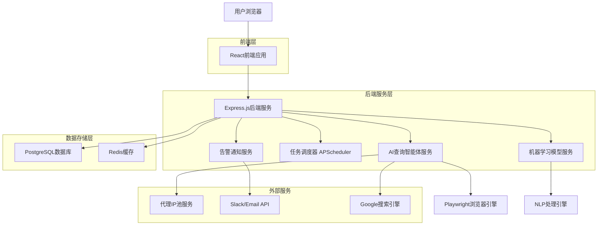
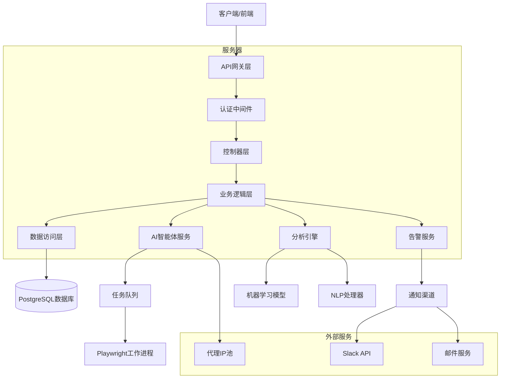
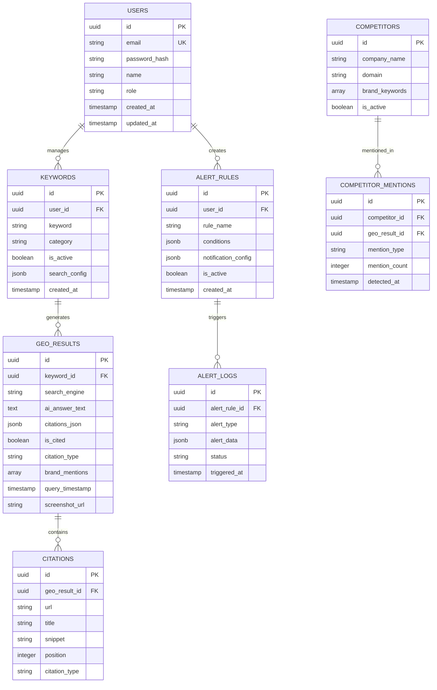

# 自动化GEO智能评估平台 - 技术架构文档

## 1. 架构设计



## 2. 技术描述

* 前端：React\@18 + TypeScript + Tailwind CSS + Vite + D3.js

* 后端：Express.js\@4 + TypeScript + Socket.io

* 数据库：PostgreSQL\@15 + Redis\@7

* AI智能体：Python\@3.11 + Playwright + BeautifulSoup4 + spaCy

* 机器学习：scikit-learn + TensorFlow Lite

* 任务调度：APScheduler + Celery

* 监控告警：Winston + Nodemailer

## 3. 路由定义

| 路由         | 用途                  |
| ---------- | ------------------- |
| /          | 登录页面，用户身份验证入口       |
| /dashboard | 仪表盘页面，显示核心指标和趋势分析   |
| /keywords  | 关键词管理页面，配置监测任务和搜索策略 |
| /analytics | 数据分析页面，深度分析和竞争对手对比  |
| /settings  | 系统配置页面，AI智能体和告警规则配置 |
| /users     | 用户管理页面，账户权限和使用统计管理  |
| /reports   | 报告页面，生成和下载分析报告      |

## 4. API定义

### 4.1 核心API

**用户认证相关**

```
POST /api/auth/login
```

请求参数：

| 参数名称     | 参数类型   | 是否必需 | 描述     |
| -------- | ------ | ---- | ------ |
| email    | string | true | 用户邮箱地址 |
| password | string | true | 用户密码   |

响应参数：

| 参数名称    | 参数类型    | 描述      |
| ------- | ------- | ------- |
| success | boolean | 登录是否成功  |
| token   | string  | JWT认证令牌 |
| user    | object  | 用户信息对象  |

**关键词管理相关**

```
GET /api/keywords
POST /api/keywords
PUT /api/keywords/:id
DELETE /api/keywords/:id
```

**数据分析相关**

```
GET /api/analytics/sov
GET /api/analytics/competitors
GET /api/analytics/trends
```

**智能体任务相关**

```
POST /api/agent/start-collection
GET /api/agent/status
POST /api/agent/stop-collection
```

**告警管理相关**

```
GET /api/alerts/rules
POST /api/alerts/rules
PUT /api/alerts/rules/:id
GET /api/alerts/history
```

示例请求：

```json
{
  "email": "analyst@company.com",
  "password": "securePassword123"
}
```

示例响应：

```json
{
  "success": true,
  "token": "eyJhbGciOiJIUzI1NiIsInR5cCI6IkpXVCJ9...",
  "user": {
    "id": "uuid-123",
    "email": "analyst@company.com",
    "role": "geo_analyst",
    "name": "张分析师"
  }
}
```

## 5. 服务器架构图



## 6. 数据模型

### 6.1 数据模型定义



### 6.2 数据定义语言

**用户表 (users)**

```sql
-- 创建用户表
CREATE TABLE users (
    id UUID PRIMARY KEY DEFAULT gen_random_uuid(),
    email VARCHAR(255) UNIQUE NOT NULL,
    password_hash VARCHAR(255) NOT NULL,
    name VARCHAR(100) NOT NULL,
    role VARCHAR(20) DEFAULT 'business_user' CHECK (role IN ('admin', 'geo_analyst', 'business_user')),
    created_at TIMESTAMP WITH TIME ZONE DEFAULT NOW(),
    updated_at TIMESTAMP WITH TIME ZONE DEFAULT NOW()
);

-- 创建索引
CREATE INDEX idx_users_email ON users(email);
CREATE INDEX idx_users_role ON users(role);
```

**关键词表 (keywords)**

```sql
-- 创建关键词表
CREATE TABLE keywords (
    id UUID PRIMARY KEY DEFAULT gen_random_uuid(),
    user_id UUID REFERENCES users(id) ON DELETE CASCADE,
    keyword VARCHAR(500) NOT NULL,
    category VARCHAR(100),
    is_active BOOLEAN DEFAULT true,
    search_config JSONB DEFAULT '{}',
    created_at TIMESTAMP WITH TIME ZONE DEFAULT NOW()
);

-- 创建索引
CREATE INDEX idx_keywords_user_id ON keywords(user_id);
CREATE INDEX idx_keywords_category ON keywords(category);
CREATE INDEX idx_keywords_is_active ON keywords(is_active);
```

**GEO结果表 (geo\_results)**

```sql
-- 创建GEO结果表
CREATE TABLE geo_results (
    id UUID PRIMARY KEY DEFAULT gen_random_uuid(),
    keyword_id UUID REFERENCES keywords(id) ON DELETE CASCADE,
    search_engine VARCHAR(50) DEFAULT 'google',
    ai_answer_text TEXT,
    citations_json JSONB DEFAULT '[]',
    is_cited BOOLEAN DEFAULT false,
    citation_type VARCHAR(50),
    brand_mentions TEXT[],
    query_timestamp TIMESTAMP WITH TIME ZONE DEFAULT NOW(),
    screenshot_url VARCHAR(500)
);

-- 创建索引
CREATE INDEX idx_geo_results_keyword_id ON geo_results(keyword_id);
CREATE INDEX idx_geo_results_query_timestamp ON geo_results(query_timestamp DESC);
CREATE INDEX idx_geo_results_is_cited ON geo_results(is_cited);
CREATE INDEX idx_geo_results_citation_type ON geo_results(citation_type);
```

**告警规则表 (alert\_rules)**

```sql
-- 创建告警规则表
CREATE TABLE alert_rules (
    id UUID PRIMARY KEY DEFAULT gen_random_uuid(),
    user_id UUID REFERENCES users(id) ON DELETE CASCADE,
    rule_name VARCHAR(200) NOT NULL,
    conditions JSONB NOT NULL,
    notification_config JSONB DEFAULT '{}',
    is_active BOOLEAN DEFAULT true,
    created_at TIMESTAMP WITH TIME ZONE DEFAULT NOW()
);

-- 创建索引
CREATE INDEX idx_alert_rules_user_id ON alert_rules(user_id);
CREATE INDEX idx_alert_rules_is_active ON alert_rules(is_active);
```

**初始化数据**

```sql
-- 插入默认管理员用户
INSERT INTO users (email, password_hash, name, role) VALUES 
('admin@geo-platform.com', '$2b$10$encrypted_password_hash', '系统管理员', 'admin');

-- 插入示例关键词
INSERT INTO keywords (user_id, keyword, category, search_config) VALUES 
((SELECT id FROM users WHERE email = 'admin@geo-platform.com'), 'AI搜索优化', 'SEO', '{"frequency": "daily", "locations": ["CN", "US"]}'),
((SELECT id FROM users WHERE email = 'admin@geo-platform.com'), '品牌营销策略', '营销', '{"frequency": "weekly", "locations": ["CN"]}');

-- 插入默认告警规则
INSERT INTO alert_rules (user_id, rule_name, conditions, notification_config) VALUES 
((SELECT id FROM users WHERE email = 'admin@geo-platform.com'), 'SoV下降告警', '{"metric": "sov", "threshold": 0.1, "direction": "decrease", "period": "3d"}', '{"channels": ["email"], "recipients": ["admin@geo-platform.com"]}');
```

